# SDLPoP2

An unofficial source reconstruction of Prince of Persia 2: The Shadow and the Flame (DOS, 1.0, from the
"Prince of Persia Collection Limited Edition" CD), in the spirit of [SDLPoP](https://github.com/NagyD/SDLPoP) for the first
game, aimed first at a headless, savestate-able game-logic core for [JaffarPlus](https://github.com/ToolAssisted-run/jaffarPlus) /
[Chimera](https://github.com/ToolAssisted-run/chimera).

Method: [Ghidra](https://github.com/NationalSecurityAgency/ghidra) decompilation of the executable with every RTLink overlay captured at its runtime
address (the game's own loader decompressed them inside a headless [DOSBox-X](https://github.com/joncampbell123/dosbox-x) oracle,
[chimera-core-dosbox-x](https://github.com/ToolAssisted-run/chimera-core-dosbox-x)), validated
function by function against that oracle (per-frame RAM diffs, instruction traces, call injection).
Analysis workspace: outside this repo, written `<workspace>` in the docs (`<workspace>/sources`: the game files,
`<workspace>/oracle`: the oracle runner and its captures, `<workspace>/work` and `<workspace>/image`: disassembly
listings and overlay images). The scripts find it through `POP2_WORKSPACE` (default `~/pop2dec`). Game data files
are never committed.

## Status (2026-09-24)
The whole program runs in C: the game logic of the 14 levels, the renderer, the story scenes (NIS), the sound drivers
(Sound Blaster digital, OPL2 FM music, PC speaker) and the program around them (title and demos, menus, save/restore,
copy protection, hall of fame). Everything is checked against the DOS game running in the headless DOSBox-X oracle:
free-running end-to-end tests reproduce captured runs of every level tick for tick (including each level's
completion), the drawing matches the game's offscreen buffer frame for frame, the sound drivers match its register
writes, and menus and scenes match its screenshots. `docs/FINDINGS.md` has everything found; `docs/AUDIO.md`,
`docs/NIS.md` and `docs/SHELL.md` cover those parts.

## Screenshots

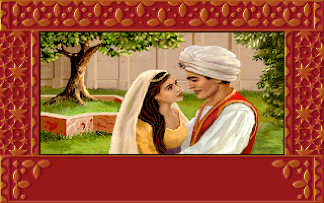
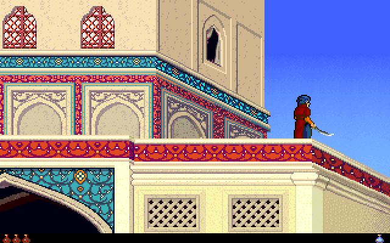
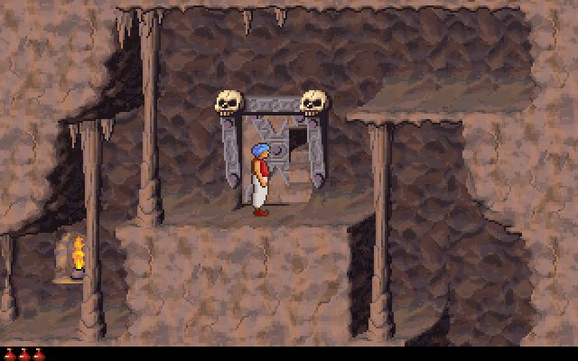
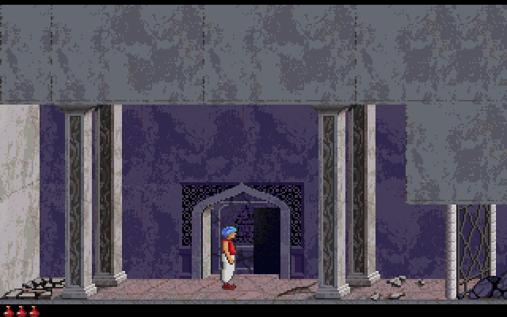
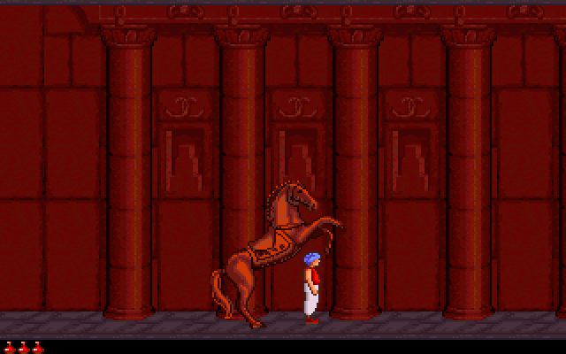
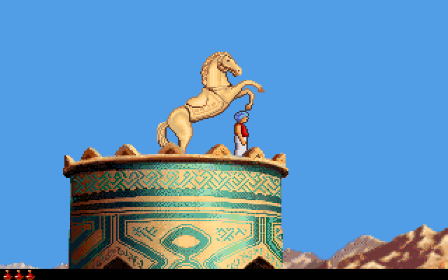

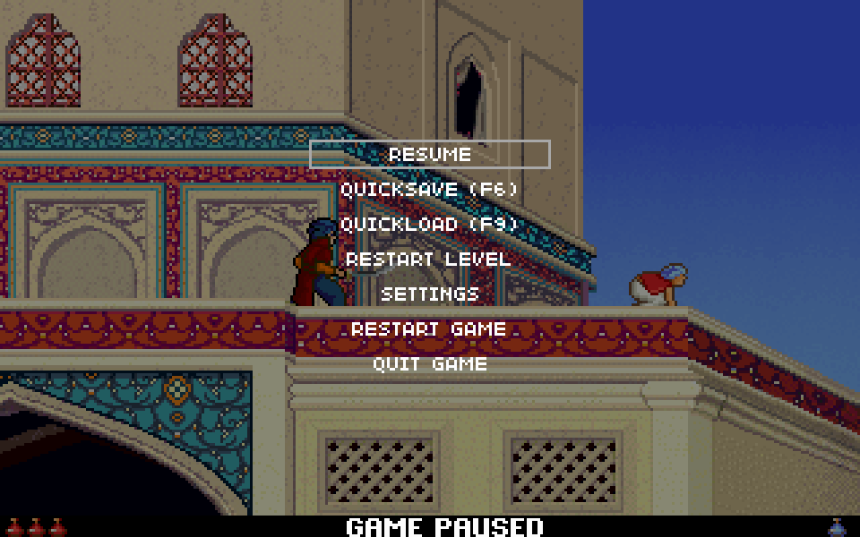
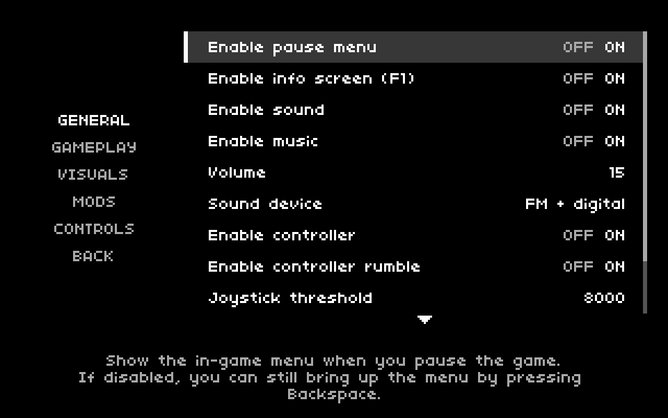
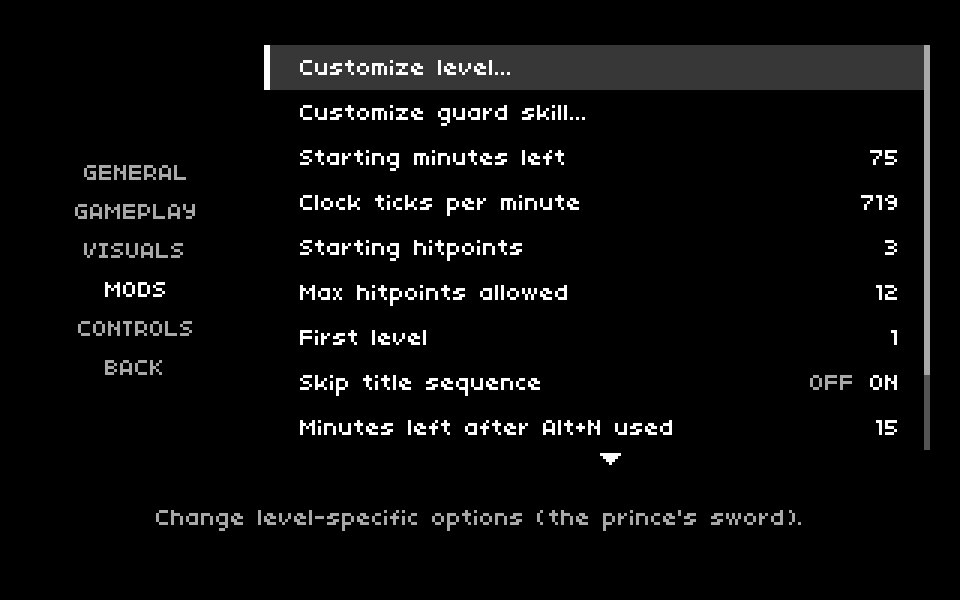

## How to play
1. Download the newest build for your system: [Windows](https://github.com/ToolAssisted-run/SDLPoP2/releases/download/dev/sdlpop2-windows-x86_64.zip) or
   [Linux](https://github.com/ToolAssisted-run/SDLPoP2/releases/download/dev/sdlpop2-linux-x86_64.tar.gz) (x86-64; built from the newest commit, on the
   [dev release](https://github.com/ToolAssisted-run/SDLPoP2/releases/tag/dev)).
2. Unpack it into the folder that has your copy of the game's files (`PRINCE.EXE`, `PRINCE.DAT`, ...; see
   [Getting the game](#getting-the-game)).
3. Start it: double-click `sdlpop2.exe` (Windows), or run `./sdlpop2` in that folder (Linux).

The keys are below. Esc, Backspace, a mouse click or a controller's Start button opens the menu.

### Keyboard (the original game's)
| | |
|---|---|
| Move | any of three 3x3 grids: the **numeric keypad / arrows + Home, PgUp, End, PgDn**; **W E R / S D F / X C V**; **U I O / J K L / M , .** (up = top row, left / right = the side keys, down = the centre and bottom-centre keys) |
| Shift (or keypad Del) | careful step, grab ledges, pick up and drink |
| Ctrl (or keypad 0) | draw the sword / strike; on level 14 the spirit casts |
| Esc | pause (with `enable_pause_menu`: the overlay menu) |
| Space | show the time left |
| Alt+A | restart the level |
| Alt+R | back to the title |
| Alt+S / Alt+M | sound / ambient music on or off |
| Alt+O | options |
| Alt+G / Alt+L | save / restore the game |
| Alt+H | hall of fame |
| Alt+J / Alt+K | joystick / keyboard mode (the DOS joystick is not supported: use a game controller) |
| Alt+V | the game's version |
| Alt+N | skip to the next level (without cheats only up to level 3, and the clock drops to 15 minutes) |
| Ctrl+Q / Alt+Q | quit |
| any key | after a death: restart |

### SDLPoP2's own keys
| | |
|---|---|
| Esc / Backspace / click | the overlay menu (Esc: with `enable_pause_menu`) |
| F1 | the key summary (`enable_info_screen`) |
| F6 / F9 | quicksave / quickload (`enable_quicksave`; loading costs a minute with `enable_quicksave_penalty`) |
| Alt+Enter | fullscreen on / off |
| In the menu | arrows / mouse / wheel to move, Enter or click to choose, Esc / Backspace / right click to go back, Home / End / PgUp / PgDn |

### Game controller (defaults; `[Controller]` in SDLPoP2.ini remaps them)
| | |
|---|---|
| D-pad / left stick | move (the 8 directions) |
| Y / A | up / down |
| X, LT, RT | Shift |
| B | Ctrl (sword; cast) |
| Start | the overlay menu (the game's pause without `enable_pause_menu`) |
| Back | restart the level |
| LB / RB | quicksave / quickload |
| Right stick click | the time left |
| In menus | D-pad / stick move, A = Enter, B = Esc, X = Tab, Y types the name "Prince"; any button = "press a key" |

### Cheats
Off by default. `--enable-cheats` (the DOS game's cheat word) turns them on from the start; the overlay menu's "Enable cheats" (SETTINGS, GAMEPLAY; SDLPoP's toggle) turns them on or off
at any time. The toggle is not saved (it is the game's state: a quicksave keeps it, a replay records it). With the
cheats on, the pause menu has CHEATS: the list below with the keys, and choosing one closes the menu and does it.
The copy protection is still asked from level 3 on, cheats or not.

| | |
|---|---|
| Alt+N | skip to the next level, any level |
| `+` / `-` | one minute more / less |
| Shift+`T` / Shift+`K` | one hit point more / less |
| `G` | the opponent one hit point more |
| `K` | kill every character in the room |
| `R` | revive a dead prince |
| Shift+`W` | feather fall |
| Shift+`I` | upside down |
| Shift+`R` | show the room number |
| Shift+`S` | temple levels and level 14: count a spirit turn |
| F3 | the demo player on / off |

SDLPoP2's own (not in the DOS game; on keys the game's controls leave free):

| | |
|---|---|
| Shift+`G` | god mode on / off: no fall, sword, head, snake, trap, crusher, sinking floor or flame hurts the prince (falls land softly, blades and bites miss, the moving walls let him through, a closing gate pushes him aside); out of the level he falls for ever, and turning god mode off then kills him |
| `H` | leave the body as the shadow, as the temple's eighth turn does but without its cost; crouch at the body to go back |
| `B` | the same as the flame (level 14's form of the spirit) |
| `Z` | the sword: none → short (levels 7–8's, 5 pixels less reach) → full; not with the sword drawn |
| Alt+arrows | look into the room left / right / above / below of the one shown (again: further); the prince goes on unseen, and leaving his room brings the view back |
| `T` | teleport the prince into the room shown, at the same place in it |
| `A` held + arrows | fly: the prince stays put (no fall, no physics), the arrows move him anywhere, across rooms; let go and he stands on a floor or falls |

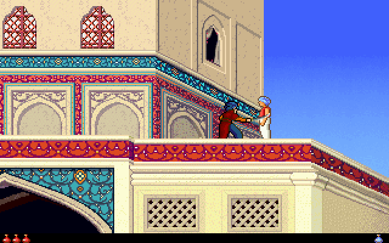
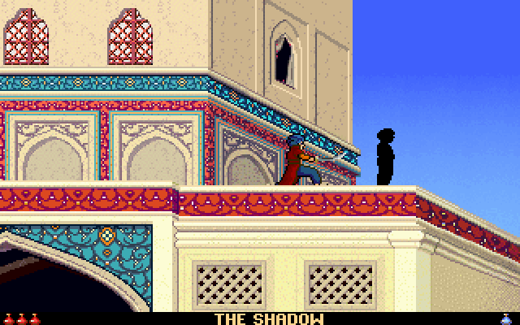
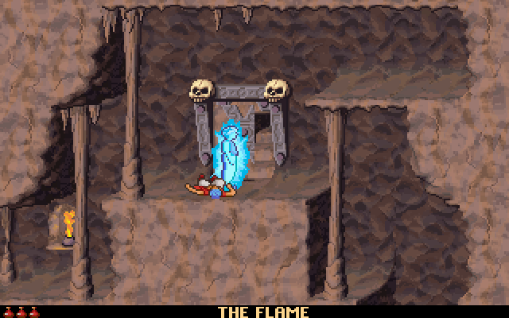
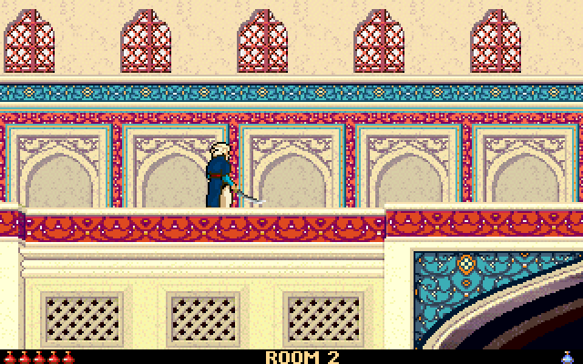
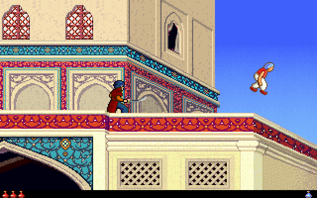
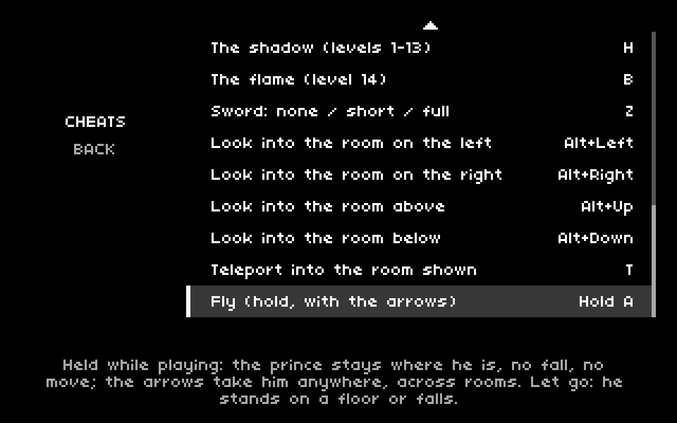

God mode against a guard's sword; the shadow beside the prince's body (level 1); the flame (level 3); looking into
room 2 (the prince stays in his own room, unseen); flying over the rooftops; the CHEATS page.

The game has one spirit: the temple levels draw it as the shadow, level 14 as the flame. `H` and `B` choose the form on
any level; only the drawing differs (level 14's casts work in either form). The game knows three sword states (none, the short sword, the full sword); the level-14 spirit's fireball is its cast
(Ctrl in rooms 7 and 8), not a sword. Like the DOS cheats, these are game state: a quicksave keeps them, a replay
records them.

## Command line
For expert users: SDLPoP2 can also be started from a terminal with options, for example to keep it apart from the
game's files (`--path-to-game`) or to start at a given level.

    sdlpop2 [--path-to-game DIR] [--enable-cheats] [--level N] [--ini PATH] [--record NAME | --replay NAME]

Every option is optional:

| Option | Default | |
|---|---|---|
| `--path-to-game DIR` | `.` (the current folder) | the folder with your copy of the game's files (see [Getting the game](#getting-the-game)) |
| `--enable-cheats` | off | cheats on from the start (see Cheats) |
| `--level N` | `0` (the intro) | start at level N (1-14) with N hit points (3 to 12), the DOS game's `LEVELn`; cheats stay off unless `--enable-cheats` |
| `--ini PATH` | `SDLPoP2.ini` | the settings file (see Settings) |
| `--record NAME` / `--replay NAME` | none | record a replay / play one back |

Options may also be written `--level=3`. A mistake in the options, a missing or incomplete game folder (it names the
missing files) or a different version of the game is reported and the program stops; on Windows the message shows
in a window. The copy protection is asked from level 3 on, whatever the options.

## Building ([meson](https://mesonbuild.com))
    meson setup build                          # options: meson_options.txt (buildFrontend, buildTools, buildTests, ...)
    meson compile -C build
    build/sdl/sdlpop2 --path-to-game path/to/prince2   # the game (options: see Playing)
                                               # (options before the directory: --ini PATH, --record NAME, --replay NAME)
Windows executables are built on Linux with mingw-w64 (SDL2 comes from the [WrapDB](https://mesonbuild.com/Wrapdb-projects.html)
wrap, built in; `sdlpop2.exe` needs only system DLLs):

    meson setup build-windows --cross-file cross/mingw-w64.ini [--cross-file cross/wine.ini]
    meson compile -C build-windows                 # build-windows/sdl/sdlpop2.exe
With `cross/wine.ini`, `meson test` runs the Windows test programs under [Wine](https://www.winehq.org). The CI
(`.github/workflows/build.yml`) builds both, runs the tests that need no game data, and publishes them: every push to
master as the rolling `dev` prerelease, and `v*` tags as releases. The released Linux executable is self-contained
too: `meson setup build --force-fallback-for=sdl2` builds SDL2 in from the wrap, and SDL loads X11 / Wayland / ALSA /
PulseAudio at run time, so only the C library is needed (glibc 2.35 or newer: built on Ubuntu 22.04).

Tests: `meson setup build -DgameDir=path/to/prince2` registers the core, settings and cheats suites (`meson test -C build --suite core --suite settings --suite cheats`);
`-DoracleTests=true` adds the oracle comparison suites (`--suite oracle`), which need the captures in `<workspace>`.
The `controller` suite (game controllers, SDL's virtual joystick) runs with or without the game files.
The game data files are not part of this repository.

## Settings (`SDLPoP2.ini`)
The SDL frontend reads `SDLPoP2.ini` (modelled on SDLPoP's `SDLPoP.ini`): `--ini PATH`, else `SDLPoP2.ini` in the
current directory, next to the binary (the build copies it to `build/sdl/`), or the installed `share/sdlpop2/SDLPoP2.ini`.
Every option is documented in the file, `default` is accepted everywhere, unknown options are reported. Every default is
the original game: `[General]` (window, 4:3 aspect, integer scaling, sharp / fuzzy / blurry scaling, music, sounds,
volume, the sound device, the intro, the story scenes, skipping the title, the in-game menu, the control keys),
`[AdditionalFeatures]` (F6 / F9 quicksave with SDLPoP's one-minute penalty, replays, the random seed, the F1 key
summary), `[Controller]` (game controllers: on / off, rumble, the stick's dead zone and horizontal-only mode, extra
mappings, the buttons), `[CustomGameplay]` (starting time and hit points, ticks per minute, the hit point cap, Alt+N's minutes, the
first level, the tick speeds), `[Level N]` (the prince's sword type) and `[Skill N]`
(the guards' strike / block / advance probabilities and refractory timers, PRINCE.EXE's DS:1BB6 / DS:13D0 tables).
The copy protection (the symbol from the manual) cannot be turned off or moved: as in the original, a game that
reaches level 3 or later - by playing on, a restored game, the level cheat, Alt+N or `first_level` - asks it first.

The core and the shell read the gameplay options through `pop2_settings_game` (`source/settings.h`), NULL unless the
frontend installs one: at each original site the code is `GAME_SETTING(field, original)`, so the headless core and the
tests run the verified code unchanged. Replays: `sdlpop2 --record NAME [options]` records a session from the
program's start (the seed, the command-line words, the gameplay settings, the game's own PRINCE.OPT / HOF / SAV and every
video frame's input) into `replays/NAME.p2r`; `sdlpop2 --replay NAME` plays it back and checks the final state and
screen (`source/replay.h`). `meson test -C build --suite settings` (with `-DgameDir`) checks that the ini's defaults are
the game's and that a scripted session records and replays identically.

### Overlay menu
The in-game menu is [SDLPoP](https://github.com/NagyD/SDLPoP)'s, transcribed from its `src/menu.c` (commit 3c5add5fb7f8)
into `sdl/overlay_menu.c` (GPL-3.0-or-later, Dávid Nagy's copyright): the same pause menu (RESUME, CHEATS, QUICKSAVE,
QUICKLOAD, RESTART LEVEL, SETTINGS, RESTART GAME, QUIT GAME) over the dimmed game, the same settings screen (GENERAL, GAMEPLAY,
VISUALS, MODS with "Customize level..." and, made like it, "Customize guard skill...", CONTROLS; toggles, numbers,
the help line, "Restore defaults...", the key redefinition and the confirmations), its font and colours, and its
keyboard, mouse and controller navigation. Esc opens it while playing (`enable_pause_menu`, SDLPoP's default: on; off,
Esc is the game's own pause), as do Backspace, a click and the controller's `button_menu` (Start). While it shows, the
game is frozen (not stepped: no ticks, no timers, the sound paused); it draws in a layer of its own over the game's
picture, which it does not touch. QUICKSAVE / QUICKLOAD are F6 / F9 (with `enable_quicksave`), RESTART LEVEL /
RESTART GAME the game's Alt+A / Alt+R, QUIT GAME ends the program (a recording is saved). Its settings are
SDLPoP2.ini's, applied at once; as SDLPoP does with `SDLPoP.cfg`, it saves them when it closes to `SDLPoP2.cfg` next to
the ini (in the ini's syntax), read after the ini unless the ini is newer. The settings that change the game (those a
replay holds) cannot be changed while a replay is recorded or played back, and a replay being played back offers no
quicksave or restart; recordings made with the menu replay exactly. "Enable cheats" (GAMEPLAY) and the CHEATS item
(shown only with the cheats on) are SDLPoP's cheats toggle and its planned cheats menu: the CHEATS page lists the
game's cheat keys, laid out as the settings, and choosing one types its key into the game; a replay records the toggle
(and the key), and while one plays back both follow the recording. There is no setting for the copy protection.
`meson test -C build --suite menu` (with `-DgameDir`) drives it headlessly (keyboard, mouse, a virtual controller).

Game controllers (`sdl/controller.c`, SDL's game controller database, hot-plugging; every connected controller drives the
game) give the game the keyboard's keys (`shell_input_key`: the arrows held, Shift, Ctrl, Esc, Alt+A, space), so the game
logic, replays and quicksaves are unchanged; the DOS game's own joystick mode (Alt+J) still reports "Joystick Not
Found". Default buttons (SDLPoP's layout, with PoP2's Ctrl on B): D-pad or left stick move (a diagonal = Home / PgUp /
End / PgDn), Y up, A down, X or a trigger Shift, B Ctrl, Start the in-game menu (Esc without `enable_pause_menu`; in
the game's pause: the pause ends), Back Alt+A (restart the level),
LB / RB quicksave / quickload, the right stick pressed space (the time left). In the menus A = Enter, B = Esc, X = Tab,
Y types the name "Prince" (the name fields), and on the title, in scenes and the demo any button is the "any key". The
prince losing hit points rumbles the controller (Kid +0x12 read by the frontend after each frame). `meson test -C build
--suite controller` checks the mapping with SDL's virtual joystick (no hardware; skipped when SDL cannot make one) and,
with `-DgameDir`, that a scripted controller session gives the same shell inputs and pop2_hash every frame as the
equivalent keyboard session.

## Core API (`source/core.h`)
    pop2_init("path/to/prince2");            // PRINCE.EXE, SEQUENCE.DAT, PRINCE.DAT, KID.DAT, guard and scenery DATs
    pop2_new_game(level, seed);              // seed: the DOS game seeds its RNG from the clock
    pop2_input in = { .x = 1 };              // x/y -1..1, shift, keystroke
    int r = pop2_frame(&in);                 // one game tick: POP2_PLAYING, POP2_QUIT, or the level just entered
    pop2_save(buf); pop2_load(buf); pop2_hash();   // pop2_state_size() bytes
In meson, `dependency` `sdlpop2Dependency` (source/meson.build; usable as a subproject). `tests/coretest.c` is a small
example (random play + savestate round trips).

## Layout
`source/*.c` by subsystem (`docs/ENGINE.md` maps them to the original segments and overlays), `source/glue.c` for the game
files and the overlay entry points, `source/state.c` for the state table, `docs/` for format notes (DAT resources,
SEQUENCE.DAT, levels), `sdl/` for the [SDL2](https://www.libsdl.org) frontend, `tools/` for the explorer and capture helpers, `tests/` for the
oracle comparisons (run by `meson test`, or directly: `tests/run_all.sh`, `tools/tiletests.sh`, `tests/run_shell.sh`).

## License and legal
SDLPoP2 is free software under the [GNU General Public License v3.0](https://www.gnu.org/licenses/gpl-3.0.html) or
later (`LICENSE`), with no warranty.

This is an unofficial reconstruction of Prince of Persia 2 (DOS) for research and education. It is not affiliated
with or endorsed by the game's rights holders, who own the game, its code, data and trademarks; the contributors
claim no ownership of it, and no game data is included (you need your own copy). Details: `NOTICE`.

**Copy protection:** this engine does not allow bypassing the original game's copy protection. As in the DOS game,
the question from the manual is asked the first time a game reaches level 3 or later, however it gets there (playing
on, a restored game, the level cheat, Alt+N or the `first_level` setting); there is no setting, command-line option,
cheat or environment variable to skip, answer or move it.

## Credits
- [SDLPoP](https://github.com/NagyD/SDLPoP) by Dávid Nagy and its contributors: this project is modelled on it,
  `SDLPoP2.ini` follows its `SDLPoP.ini`, and the in-game menu (`sdl/overlay_menu.c`) is its `src/menu.c`
  (GPL-3.0-or-later).
- The overlay menu's small font comes with SDLPoP's menu; its letters are from Yuji Oshimoto's freeware font 04b_03.
- [Nuked OPL3](https://github.com/nukeykt/Nuked-OPL3) by Nuke.YKT: the OPL2/OPL3 emulator in `source/audio_opl3.*`
  (LGPL-2.1-or-later).
- The original game: *Prince of Persia 2: The Shadow and the Flame* (Brøderbund, 1993), designed by Jordan Mechner.

**Getting the game:** SDLPoP2 needs the original game's data files, which are not included. The game is not
currently sold digitally; the legal way to obtain them is an original copy of *Prince of Persia 2: The Shadow and
the Flame* for MS-DOS (1993, Brøderbund) or the *Prince of Persia Collection Limited Edition* CD (the version this
project targets). You can ask for an official re-release by voting on its
[GOG Dreamlist page](https://www.gog.com/dreamlist/game/prince-of-persia-2-the-shadow-and-the-flame).
